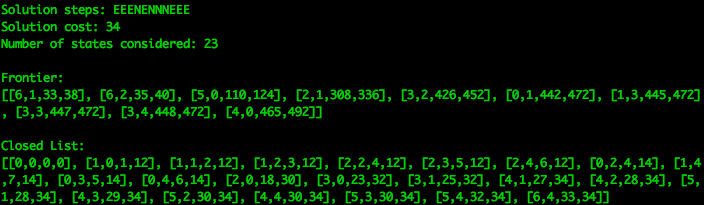

An environment might look like this:

Here, the integer values at each location represent the elevation of that location. The default goal state for this map is in the red square.

The default energy budget is 100. The default starting location for an agent is 0,0 although the defaults can be changed with command-line options to main.py

The code can be invoked in the command-line by running:
./main.py search.py <test-name>.map

The solution provides the steps to the goal in the form of the directions North, East, South and West. It also provides a frontier array (an array of states which are at the frontier at the end of the search) and a closed list array(an array of states which have been expanded during the search).

This is how the output will be displayed :

